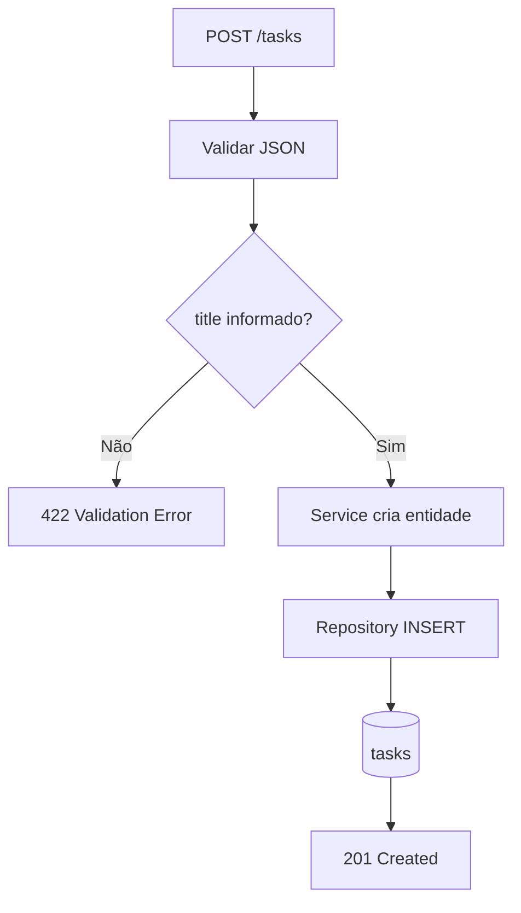
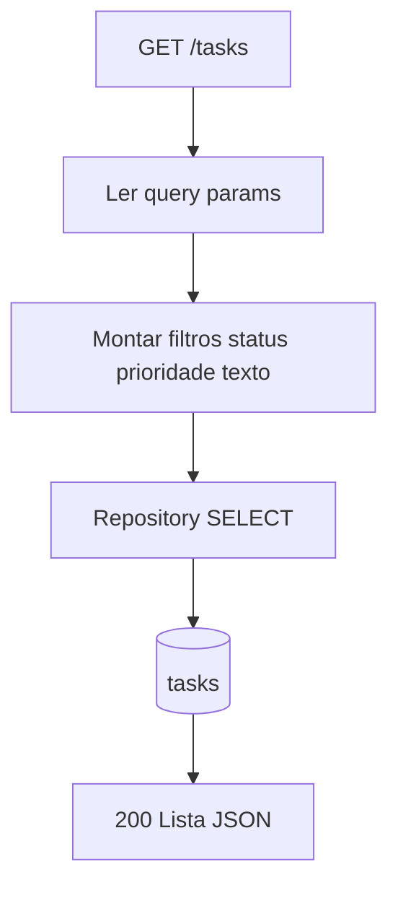
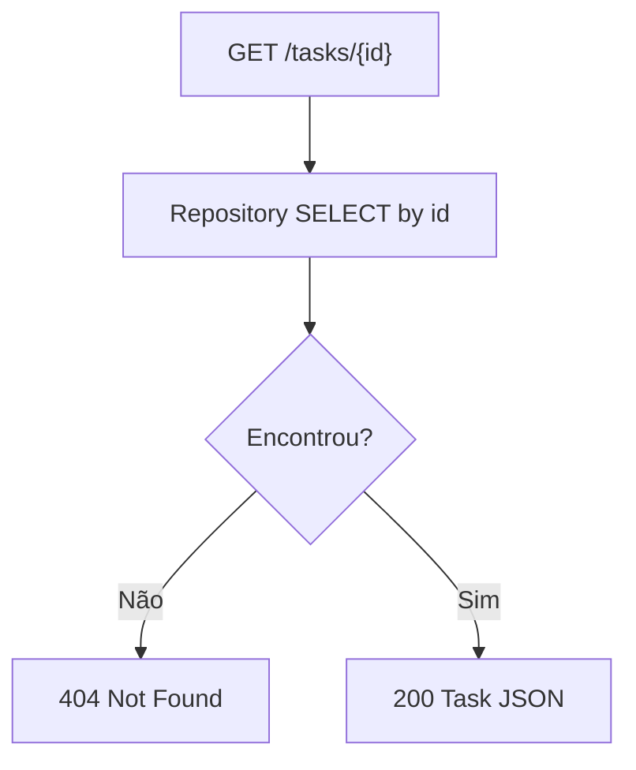
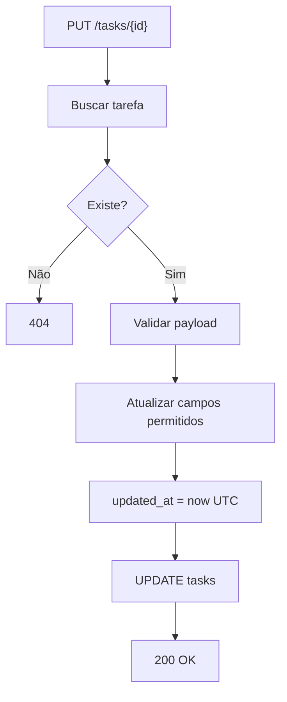
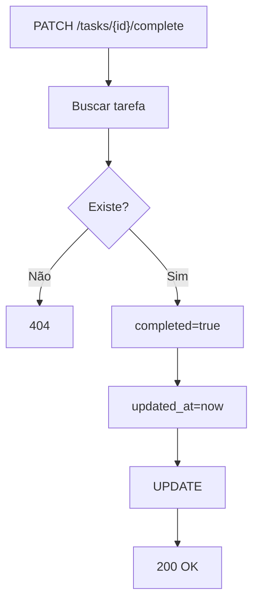
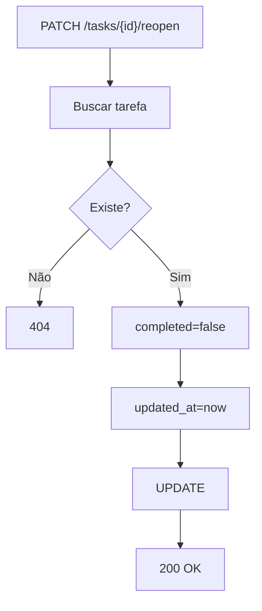
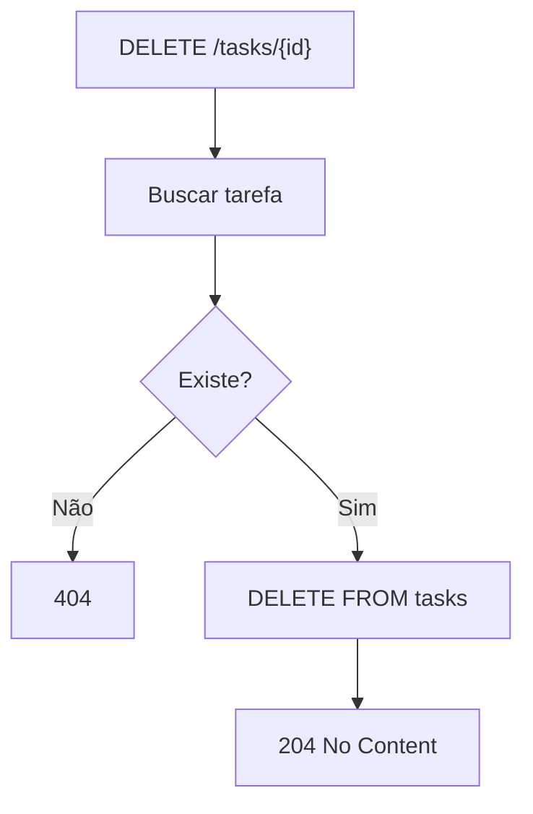
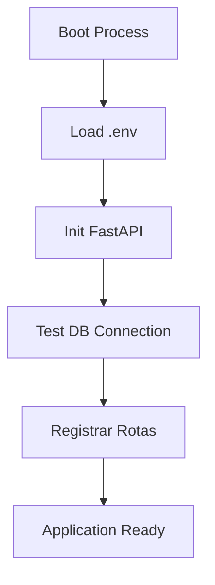
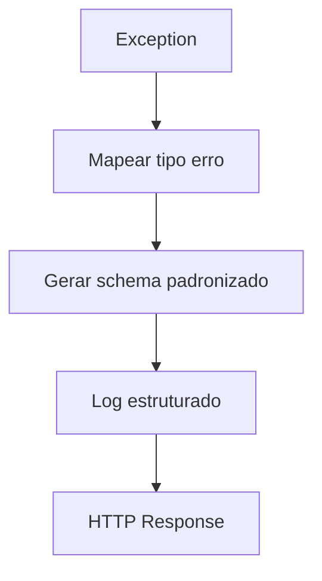

# SOFTWARE ARCHITECTURE DOCUMENT (SAD)
## Projeto: TaskFlow API
Versão: 1.0 Premium

---

# 1. Objetivo do Sistema

Construir uma micro-API REST para gerenciamento de tarefas, permitindo criar, listar, consultar por ID, atualizar, concluir, reabrir e excluir tarefas. O sistema foi concebido como MVP acadêmico/local, porém com base arquitetural preparada para evolução enterprise.

---

# 2. Resumo Executivo da Arquitetura

Arquitetura em camadas desacopladas:

Client -> FastAPI Controllers -> Service Layer -> Repository Layer -> SQLAlchemy ORM -> PostgreSQL

Princípios:
- Separação de responsabilidades
- Alta testabilidade
- Baixo acoplamento
- Evolução incremental
- Padronização de contratos HTTP
- Preparação para autenticação futura

---

# 3. Requisitos Arquiteturalmente Relevantes

## Funcionais
- FR-001 Criar tarefa
- FR-002 Listar tarefas com filtros
- FR-003 Consultar por ID
- FR-004 Atualizar tarefa
- FR-005 Concluir tarefa
- FR-006 Reabrir tarefa
- FR-007 Excluir tarefa

## Não Funcionais
- p95 < 300ms ambiente local
- Cobertura de testes >= 80%
- Logs padronizados
- Código modular
- Swagger/OpenAPI ativo

---

# 4. Premissas e Assunções

| Premissa | Motivo | Impacto | Risco |
|---|---|---|---|
| PostgreSQL local | definido no SRS | simplicidade operacional | baixa HA |
| Sem autenticação no MVP | foco em escopo mínimo | menor complexidade | acesso irrestrito |
| Projeto individual | contexto acadêmico | time reduzido | concentração de conhecimento |
| UTC timestamps | consistência temporal | integração futura facilitada | nenhum |
| Single node | custo mínimo | deploy simples | indisponibilidade total em falha |

---

# 5. Visão de Componentes

## Router Layer
Responsável por endpoints, serialização, status code e OpenAPI.

## Service Layer
Responsável por regras de negócio, validações adicionais, timestamps, transições de estado.

## Repository Layer
Responsável por persistência e queries.

## Models Layer
Entidades SQLAlchemy.

## Schemas Layer
DTOs Pydantic de entrada e saída.

---

# 6. Modelo de Dados

## Tabela tasks

| Campo | Tipo | Regra |
|---|---|---|
| id | UUID PK | gerado automaticamente |
| title | varchar(255) | obrigatório |
| description | text | opcional |
| completed | boolean | default false |
| priority | smallint | default 3 |
| due_date | timestamptz | opcional |
| created_at | timestamptz | UTC |
| updated_at | timestamptz | UTC |

## Índices Recomendados
- PK(id)
- idx_tasks_completed
- idx_tasks_priority
- idx_tasks_due_date

---

# 7. Fluxos Lógicos

## FLW-001 Criar tarefa

## FLW-002 Listar tarefas

## FLW-003 Consultar por ID

## FLW-004 Atualizar tarefa

## FLW-005 Concluir tarefa

## FLW-006 Reabrir tarefa

## FLW-007 Excluir tarefa

## FLW-008 Startup da Aplicação

## FLW-009 Tratamento Global de Erros

# 8. Integrações Externas

| Sistema | Uso |
|---|---|
| PostgreSQL | persistência principal |
| Swagger UI | documentação |

---

# 9. Segurança

MVP:
- Sem autenticação
- ORM reduz risco SQL injection
- Validação Pydantic
- Tratamento padronizado de erros

Roadmap:
- JWT
- RBAC
- Rate limiting
- Audit trail

---

# 10. Escalabilidade e Performance

Meta de desempenho: p95 < 300ms.

Estratégias:
- Índices adequados
- Pool de conexões
- Queries seletivas
- Paginação futura
- Workers múltiplos Uvicorn

---

# 11. Disponibilidade e Resiliência

MVP:
- single node
- restart manual

Futuro:
- healthcheck
- restart policy
- backup diário
- réplica leitura

---

# 12. Observabilidade

- Logs estruturados JSON
- Correlation ID
- Métrica latência por rota
- Taxa erro 4xx/5xx
- Endpoint /health

---

# 13. Infraestrutura e Deploy

## Atual
- Python 3.12
- FastAPI
- PostgreSQL 15
- Uvicorn

## Futuro
- Docker
- CI/CD
- Kubernetes opcional

---

# 14. Riscos Técnicos e Mitigação

| Risco | Mitigação |
|---|---|
| Crescimento sem versionamento | /api/v1 |
| Baixa cobertura testes | CI + pytest |
| Acoplamento entre camadas | service layer |
| Erros inconsistentes | schema único |

---

# 15. Rastreabilidade SRS -> Arquitetura

| Requisito | Componentes |
|---|---|
| FR-001 | Router + Service + Repo |
| FR-002 | Router + Repo |
| FR-003 | Router + Repo |
| FR-004 | Router + Service + Repo |
| FR-005 | Service |
| FR-006 | Service |
| FR-007 | Repo |

---

# 16. Roadmap Evolutivo

## v1.1
- JWT Auth

## v1.2
- Tags/Categorias
- Paginação

## v2
- Multiusuário
- Notificações
- Dashboard

---

# 17. Estimativa de Esforço

## Porte
Pequeno

## Time sugerido
- 1 Backend Dev
- QA parcial

## Esforço
8 a 14 homem-dia

## Faixa Financeira BRL
R$ 8.000 a R$ 22.000

---

# 18. Nota Final Arquitetural

9.4 / 10

