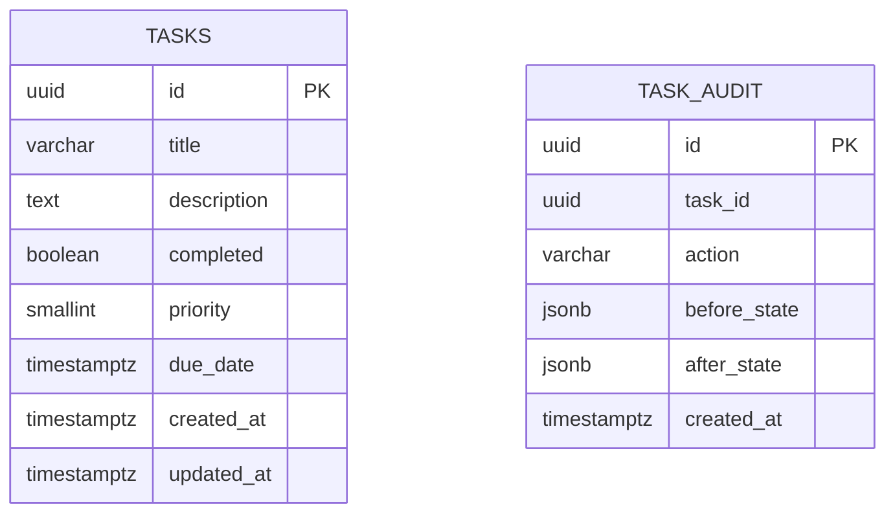
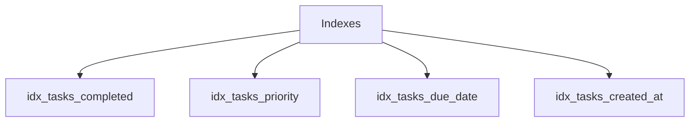

```mermaid
erDiagram
TASKS {
    uuid id PK
    varchar title
    text description
    boolean completed
    smallint priority
    timestamptz due_date
    timestamptz created_at
    timestamptz updated_at
}

TASK_AUDIT {
    uuid id PK
    uuid task_id
    varchar action
    jsonb before_state
    jsonb after_state
    timestamptz created_at
}
```

```mermaid
flowchart TD
A[Indexes] --> B[idx_tasks_completed]
A --> C[idx_tasks_priority]
A --> D[idx_tasks_due_date]
A --> E[idx_tasks_created_at]
```

