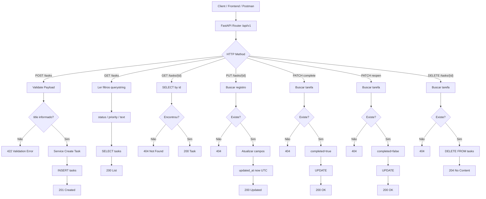

```mermaid
flowchart TD
A[Client / Frontend / Postman] --> B[FastAPI Router /api/v1]
B --> C{HTTP Method}

C -->|POST /tasks| D1[Validate Payload]
D1 --> E1{title informado?}
E1 -->|Não| X1[422 Validation Error]
E1 -->|Sim| F1[Service Create Task]
F1 --> G1[INSERT tasks]
G1 --> H1[201 Created]

C -->|GET /tasks| D2[Ler filtros querystring]
D2 --> E2[status / priority / text]
E2 --> F2[SELECT tasks]
F2 --> H2[200 List]

C -->|"GET /tasks/{id}"| D3[SELECT by id]
D3 --> E3{Encontrou?}
E3 -->|Não| X3[404 Not Found]
E3 -->|Sim| H3[200 Task]

C -->|"PUT /tasks/{id}"| D4[Buscar registro]
D4 --> E4{Existe?}
E4 -->|Não| X4[404]
E4 -->|Sim| F4[Atualizar campos]
F4 --> G4[updated_at now UTC]
G4 --> H4[200 Updated]

C -->|PATCH complete| D5[Buscar tarefa]
D5 --> E5{Existe?}
E5 -->|Não| X5[404]
E5 -->|Sim| F5[completed=true]
F5 --> G5[UPDATE]
G5 --> H5[200 OK]

C -->|PATCH reopen| D6[Buscar tarefa]
D6 --> E6{Existe?}
E6 -->|Não| X6[404]
E6 -->|Sim| F6[completed=false]
F6 --> G6[UPDATE]
G6 --> H6[200 OK]

C -->|"DELETE /tasks/{id}"| D7[Buscar tarefa]
D7 --> E7{Existe?}
E7 -->|Não| X7[404]
E7 -->|Sim| F7[DELETE FROM tasks]
F7 --> H7[204 No Content]
```

